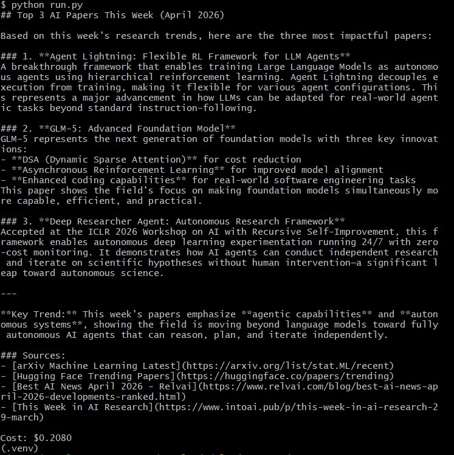

# claude_managed_agents

A minimal, working "hello world" for the **Claude Agent SDK** running as a Managed Agent, **plus a complete five-part tutorial series in `docs/`** that takes you from architectural mental model to a full capstone research agent. Two things in one repo: 30 lines of code you can run in five minutes, and ~2.5 hours of tutorial reading that explains every concept the code touches and many it doesn't.

This repo is the smallest reproducible starting point I could get to actually execute on a fresh Windows + Git Bash machine. If you can `git clone` it, drop in an API key, and run `python run.py`, you have a working autonomous agent loop on your laptop in under five minutes. Then you read the docs and understand *why* it works.



*Above: actual terminal output of `python run.py` on first successful run. The agent autonomously called `WebSearch` and `WebFetch`, picked three papers from this week, summarized them with sources, and reported the total spend on the last line.*

## The tutorial in `docs/` — start here if you're new to Managed Agents

The `docs/` folder is the part of this repo most people will get the most value from. It is a self-contained zero-to-hero series written specifically for developers who have never built an agent before and want to understand the Claude Managed Agents stack from first principles, not just copy-paste a snippet. Each part builds on the previous one and is designed to be read in order.

| File | What it covers | Read time |
|---|---|---|
| `docs/part1_mental_model.md` | The architecture, the split between SDK and CLI, what "managed" actually means, and the core concepts (agent loop, turns, tools, context window) you need before you write any code | ~15 min |
| `docs/part2_setup_and_first_agent.md` | Install, environment setup, and a line-by-line walkthrough of `run.py` (the script in this repo) | ~30 min |
| `docs/part3_agent_loop_deep_dive.md` | Turns, message types, the context window, automatic compaction, and how the SDK streams structured messages back to your Python code | ~25 min |
| `docs/part4_tools_permissions_control.md` | The full tool catalog (`WebSearch`, `WebFetch`, `Bash`, `Read`, `Write`, custom `@tool` functions), permission modes (`dontAsk` vs `acceptEdits` vs interactive), and how to bound cost with `max_turns` and budget caps | ~25 min |
| `docs/part5_capstone_research_agent.md` | A full project: an AI Research Digest Agent that runs daily, scrapes arXiv, summarizes papers, and emails you the result. Combines everything from parts 1–4 into something actually useful | ~45 min |

Total: ~2.5 hours end-to-end. If you're new to Managed Agents and only have time for one thing, read **part 1** (the mental model) — it's the unlock that makes everything else click. If you have an afternoon, read all five and build the capstone.

The tutorials are derived from official Anthropic documentation (`platform.claude.com/docs/en/managed-agents/*` and `platform.claude.com/docs/en/agent-sdk/*`) but reorganized into a learning sequence rather than reference material. The official docs are excellent reference once you know what you're looking for; these tutorials are the on-ramp to get you there.

---

## What this is

Anthropic ships two things that look similar but are not:

- **Claude.ai** — the consumer chat product (Free / Pro / Max subscription).
- **Claude Platform / Agent SDK** — the developer API and Python SDK for building autonomous agents that use tools, manage their own context, and run unattended. Billed per-token against a separate prepaid balance at `console.anthropic.com`.

This project uses the second one. Specifically it uses `claude-agent-sdk` (Python), which is a thin wrapper that spawns the **Claude Code CLI** (`claude`, a Node binary) as a subprocess and drives it over stdio. The CLI handles the agent loop — turn-taking, tool execution, context compaction, streaming — so the Python code stays tiny.

The example calls `query()` with a single prompt and grants the agent two tools: `WebSearch` and `WebFetch`. The agent decides on its own how many search/fetch turns to take (capped at 15), composes a summary, and reports the total spend.

## Why bother

Three reasons this 30-line script is worth understanding before you build anything bigger:

1. **It is the minimum viable agent loop.** Everything more sophisticated — multi-tool research agents, code-writing agents, long-running daily digest workers — is the same shape with more tools and a longer prompt. Get this running and the rest is additive.
2. **It exposes the full economics.** The `Cost:` line at the end is the real, all-in dollar cost of one autonomous run including tool-use overhead. You learn fast what a $0.02 run looks like vs a $0.20 one, which is the only way to develop intuition for what's affordable to automate.
3. **It is the runnable companion to the tutorial series in `docs/`.** Part 2 of the tutorial walks through this exact script line by line. Run the code, then read the tutorial to understand it — that pairing is the fastest path to fluency.

## How to run it

Tested on Windows 11 + Git Bash + Python 3.13 + Node 20. Should work identically on macOS/Linux with `python3` instead of `python`.

### Prerequisites

- Python 3.10 or newer
- Node.js 18 or newer
- An Anthropic API key from <https://console.anthropic.com/settings/keys>
- A prepaid credit balance on the **API console** (NOT a Claude.ai Pro/Max subscription — those are separate). $5 is plenty for hundreds of runs of this example.

### One-time setup

```bash
# 1. Clone
git clone https://github.com/az9713/claude_managed_agents.git
cd claude_managed_agents

# 2. Install the Claude Code CLI globally (Node side)
npm install -g @anthropic-ai/claude-code
claude --version    # confirm it's on PATH

# 3. Create a Python virtual environment (Python side)
python -m venv .venv
source .venv/Scripts/activate     # Git Bash on Windows
# source .venv/bin/activate       # macOS / Linux

# 4. Install Python dependencies and create .env
bash install.sh

# 5. Paste your real key into .env
#    (replace the placeholder ANTHROPIC_API_KEY value)
```

### Running

```bash
source .venv/Scripts/activate     # every new shell session
python run.py
```

Expected output: 30–90 seconds of silence while the agent searches and reads, then a printed summary of three recent AI papers, then a `Cost: $0.0xxx` line. Typical cost on `claude-haiku-4-5` is **$0.01–$0.05**.

### Common failure modes

| Symptom | Cause | Fix |
|---|---|---|
| `Credit balance is too low` | API console balance is $0 | Add credits at <https://console.anthropic.com/settings/billing> |
| `FileNotFoundError: 'claude'` | Node CLI not on PATH | Re-run `npm install -g @anthropic-ai/claude-code`, restart shell |
| `ModuleNotFoundError: claude_agent_sdk` | venv not activated | `source .venv/Scripts/activate` |
| `unexpected keyword argument 'max_budget_usd'` | SDK version drift | Delete that line in `run.py` |
| `anthropic.AuthenticationError` | Bad / missing key in `.env` | Re-paste key, check no trailing whitespace |

## Files

```
.
├── README.md          # this file
├── .gitignore         # excludes .env, .venv, caches
├── .env.example       # template — copy to .env and edit
├── requirements.txt   # claude-agent-sdk, python-dotenv
├── install.sh         # idempotent installer for Git Bash / bash
├── run.py             # the 30-line agent example
└── docs/              # zero-to-hero tutorial series (5 parts)
```

## Security

The `.env` file is in `.gitignore`. **Never commit it.** API keys leaked to public GitHub get scraped by bots within seconds; rotate immediately at <https://console.anthropic.com/settings/keys> if you suspect exposure. For real projects, use **workspace-scoped keys** with per-workspace spend limits so a leaked key can't drain your whole balance.

## Where to go next

Once `run.py` works:

1. **Read the `docs/` series in order** (parts 1 → 5). This is the single highest-leverage thing you can do with this repo. Part 1 alone will save you hours of confusion later.
2. **Switch from `query()` to `ClaudeSDKClient`** to keep state across multiple prompts and benefit from prompt caching (~10× cost reduction on repeat-context workflows). Covered in part 3.
3. **Add a custom tool** via the `@tool` decorator — the agent loop lets your agent call your own Python functions in addition to web search. Covered in part 4.
4. **Build the capstone** in part 5 and schedule it as a daily cron / Task Scheduler job that emails you the digest. A year of daily Haiku-4.5 runs of this script costs ~$3.

## License

MIT. Do whatever you want.
