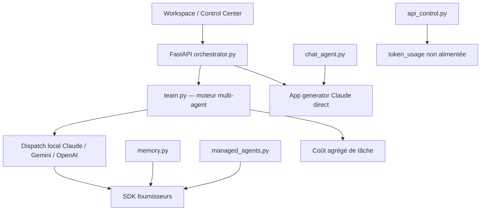
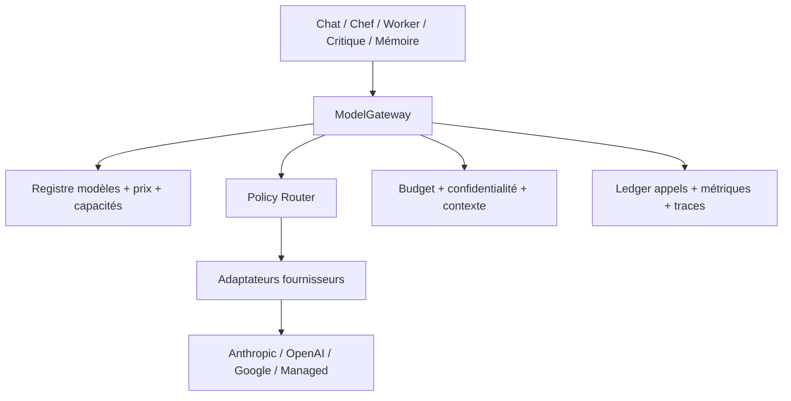

# Cahier des charges — Optimisation de la gestion multi‑modèle

**Projet audité :** `flotellop-art/Orchestrateur-`  
**Branche / révision :** `main` — `102a2288d7259e7a509282fdc91b7f3c5cf53ba6`  
**Date de l’audit :** 10 juillet 2026  
**Nature du livrable :** audit technique et cahier des charges, sans modification du dépôt

## 1. Décision recommandée

Faire évoluer l’application par refonte incrémentale autour d’une **passerelle de modèles unique** (`ModelGateway`) et d’un **registre versionné des modèles**. Tous les appels Claude, Gemini, OpenAI, embeddings, résumés, chat, génération d’application et agents gérés devront passer par ce socle commun ou par un adaptateur explicitement déclaré.

Cette priorité est plus structurante qu’un nouveau modèle ou qu’une règle de routage supplémentaire : le dépôt sait déjà appeler plusieurs fournisseurs, mais chaque fonction transverse — catalogue, coût, repli, métriques, sécurité et UI — est actuellement répartie dans plusieurs implémentations qui divergent.

### Résultat attendu

À l’issue du projet :

- un modèle peut être ajouté, désactivé ou déprécié dans un registre sans modifier les écrans ni le moteur d’orchestration ;
- chaque tâche est routée selon ses capacités requises, son budget, sa sensibilité, sa latence cible et son niveau de qualité ;
- les replis sont contrôlés, traçables et n’envoient jamais silencieusement des données à un autre fournisseur ;
- le coût est réservé avant l’appel, réconcilié après l’appel et visible pour 100 % des consommations ;
- un challenge annoncé comme « multi‑fournisseur » garantit réellement la diversité demandée ou se déclare dégradé ;
- les historiques restent sous la fenêtre de contexte du modèle ;
- le paquet Electron démarre avec toutes ses dépendances et ne contient aucun secret.

## 2. Périmètre et méthode

L’audit couvre le code, la configuration, les interfaces, le packaging, les issues et les pull requests visibles sur GitHub. Il porte principalement sur :

- le dispatch Claude / Gemini / OpenAI ;
- la sélection des modèles et des rôles ;
- les appels directs qui contournent le dispatch ;
- le fallback, les erreurs, les timeouts et la concurrence ;
- le budget, les tokens, les tarifs et le monitoring ;
- les contextes, le JSON structuré, les outils et la vision ;
- le challenge multi‑modèle ;
- les tests, la CI, la documentation et la livraison desktop.

Le dépôt contient 68 fichiers à la révision auditée. Les 18 fichiers Python ont été analysés syntaxiquement sans erreur et les principaux fichiers Electron passent `node --check`. En revanche, aucune suite de tests Python ni workflow GitHub Actions n’est présent sur la branche auditée.

## 3. Architecture observée



### Composants factuels

| Zone | État actuel | Référence |
| --- | --- | --- |
| Moteur multi‑modèle | Trois adaptateurs locaux Claude, Gemini et OpenAI | [`team.py` L390‑530](https://github.com/flotellop-art/Orchestrateur-/blob/102a2288d7259e7a509282fdc91b7f3c5cf53ba6/team.py#L390-L530) |
| Modèles et prix | Constantes et tarifs codés en dur dans le moteur | [`team.py` L47‑78](https://github.com/flotellop-art/Orchestrateur-/blob/102a2288d7259e7a509282fdc91b7f3c5cf53ba6/team.py#L47-L78) |
| Orchestration | Chef Claude, workers multi‑fournisseurs, assignations parallèles | [`team.py` L1442‑1716](https://github.com/flotellop-art/Orchestrateur-/blob/102a2288d7259e7a509282fdc91b7f3c5cf53ba6/team.py#L1442-L1716) |
| Challenge | Producteur puis critiques ; diversité demandée par défaut, mais non garantie | [`team.py` L1256‑1371](https://github.com/flotellop-art/Orchestrateur-/blob/102a2288d7259e7a509282fdc91b7f3c5cf53ba6/team.py#L1256-L1371) |
| Ancien générateur | Appel Claude Sonnet direct, hors dispatch | [`orchestrator.py` L224‑261](https://github.com/flotellop-art/Orchestrateur-/blob/102a2288d7259e7a509282fdc91b7f3c5cf53ba6/orchestrator.py#L224-L261) |
| Chat | Appel Anthropic streamé et modèle forcé | [`chat_agent.py` L159‑191](https://github.com/flotellop-art/Orchestrateur-/blob/102a2288d7259e7a509282fdc91b7f3c5cf53ba6/chat_agent.py#L159-L191) |
| Mémoire | Embeddings OpenAI, résumé Anthropic, fallback textuel | [`memory.py` L30‑68](https://github.com/flotellop-art/Orchestrateur-/blob/102a2288d7259e7a509282fdc91b7f3c5cf53ba6/memory.py#L30-L68), [`memory.py` L274‑308](https://github.com/flotellop-art/Orchestrateur-/blob/102a2288d7259e7a509282fdc91b7f3c5cf53ba6/memory.py#L274-L308) |
| Agents gérés | Pont spécifique Anthropic | [`managed_agents.py` L44‑188](https://github.com/flotellop-art/Orchestrateur-/blob/102a2288d7259e7a509282fdc91b7f3c5cf53ba6/managed_agents.py#L44-L188) |
| Monitoring | Deuxième catalogue tarifaire et table `token_usage` | [`api_control.py` L47‑81](https://github.com/flotellop-art/Orchestrateur-/blob/102a2288d7259e7a509282fdc91b7f3c5cf53ba6/api_control.py#L47-L81), [`api_control.py` L175‑275](https://github.com/flotellop-art/Orchestrateur-/blob/102a2288d7259e7a509282fdc91b7f3c5cf53ba6/api_control.py#L175-L275) |
| UI | Listes de modèles codées en dur, contrats différents selon l’écran | [`workspace.html` L150‑174](https://github.com/flotellop-art/Orchestrateur-/blob/102a2288d7259e7a509282fdc91b7f3c5cf53ba6/static/workspace.html#L150-L174), [`control.html` L242‑260](https://github.com/flotellop-art/Orchestrateur-/blob/102a2288d7259e7a509282fdc91b7f3c5cf53ba6/static/control.html#L242-L260) |

## 4. Points solides à conserver

- Séparation `provider` / `model` dans la table des agents.
- Adaptateurs fonctionnels pour trois fournisseurs et imports paresseux pour Gemini/OpenAI.
- Modèle worker Claude moins coûteux que le modèle chef par défaut.
- Notification SSE lors d’un fallback.
- Prompt caching Anthropic sur le système du moteur.
- Budget maximum par tâche et remontée de tokens dans le workspace.
- Parallélisation des assignations et des outils explicitement passifs.
- Challenge producteur / critiques et prise en charge de la vision.
- Mémoire persistante avec repli sans embeddings.
- Agents Anthropic gérés intégrés comme mode de délégation spécialisé.
- Variables d’environnement pour les clés et durcissement Electron déjà amorcé.

Les issues [#8 — fallback Claude](https://github.com/flotellop-art/Orchestrateur-/issues/8) et [#15 — parallélisme](https://github.com/flotellop-art/Orchestrateur-/issues/15) sont clôturées et leurs fonctions sont visibles dans le code. L’issue [#7 — collaboration multi‑modèles](https://github.com/flotellop-art/Orchestrateur-/issues/7) reste ouverte : l’intégration existe, mais la gestion unifiée et garantie n’est pas terminée.

## 5. Audit priorisé

### 5.1 Bloquants P0

| ID | Constat prouvé | Impact | Correction attendue |
| --- | --- | --- | --- |
| A‑01 | Il n’existe pas de gateway ni de registre unique. Au moins cinq chemins de production appellent directement un SDK. | Toute amélioration de coût, sécurité ou résilience reste partielle. | Centraliser les appels dans `ModelGateway`, avec adaptateurs spécialisés. |
| A‑02 | Le catalogue et les tarifs sont dupliqués entre `team.py` et `api_control.py`. GPT‑5.5 vaut 5/30 $ par MTok dans le premier et 10/30 dans le second ; Gemini 3.5 Flash vaut 0,30/2,50 contre 0,075/0,30. Le prix inconnu diffère aussi. | Budgets et dashboard peuvent diverger fortement pour le même appel. | Une seule table versionnée de prix, avec date d’effet et catégories de tokens. |
| A‑03 | `api_control.record_token_usage()` est défini mais jamais appelé. Le moteur ne met à jour que `tasks.total_cost_usd`, alors que le dashboard lit `token_usage`. | Le monitoring peut afficher zéro malgré une consommation réelle. | Écrire un événement de consommation atomique pour chaque tentative fournisseur. |
| A‑04 | Le contrat du dashboard diverge également : l’UI attend `tokens.global`, `tokens.last_24h` et `tokens.by_model`, mais l’API renvoie `providers`, `totals` et `series` au premier niveau. | Le panneau reste vide ou à zéro même si la table est alimentée. | Définir et tester un schéma d’API unique, versionné. |
| A‑05 | Toute exception Gemini/OpenAI déclenche un repli vers Claude Opus ; Claude ne possède qu’un second essai sur Sonnet. Il n’y a ni classification d’erreur, ni retry/backoff, ni timeout explicite, ni circuit breaker. | Surcoût, tempête de requêtes, latence non bornée et masquage des erreurs de configuration ou de contenu. | Taxonomie d’erreurs et politique de résilience configurable. |
| A‑06 | Le fallback inter‑fournisseurs peut transférer silencieusement un prompt initialement destiné à Gemini/OpenAI vers Anthropic. | Risque de confidentialité, résidence des données et consentement. | Fallback inter‑fournisseurs explicitement autorisé par politique et sensibilité. |
| A‑07 | Le budget est contrôlé après l’appel. Les appels parallèles et tous les chemins hors `team.call_model` peuvent dépasser ou ignorer le plafond. | Le budget annoncé n’est pas une limite dure. | Réservation atomique pré‑appel, réconciliation post‑appel et couverture exhaustive. |
| A‑08 | Le paquet Electron omet `electron_hardening.js` et les modules Python requis (`team`, `api_control`, `managed_agents`, `memory`, `auth_middleware`, `patches/**`), tout en embarquant `.env`. Le lanceur retombe sur le `python` système sans fournir de runtime ni installer les dépendances. | Artefact probablement non démarrable sur une machine propre et risque d’inclure les trois clés fournisseurs. | Embarquer runtime, dépendances et modules dans la release desktop ; utiliser un coffre OS et scanner l’artefact. |
| A‑SEC | Les noms de fichiers renvoyés par le modèle sont écrits directement, puis `requirements.txt` est installé et `app.py` exécuté ([preuve](https://github.com/flotellop-art/Orchestrateur-/blob/102a2288d7259e7a509282fdc91b7f3c5cf53ba6/orchestrator.py#L330-L365)). L’API écoute sur toutes les interfaces alors que l’auth est optionnelle. | Une sortie LLM non fiable peut toucher l’hôte ; l’exposition réseau augmente ce risque. | Confiner les chemins, approuver les dépendances, isoler l’exécution et écouter localement par défaut. |
| A‑09 | Aucun test Python ni workflow CI n’est présent dans la branche actuelle ; le build local traite même « aucun test collecté » comme un succès ([preuve](https://github.com/flotellop-art/Orchestrateur-/blob/102a2288d7259e7a509282fdc91b7f3c5cf53ba6/team.py#L2202-L2205)). | Les changements de routage, prix et fallback ne sont pas sécurisés. | Suite contractuelle, tests de chaos, tests budget/concurrence et CI obligatoire. |

### 5.2 Majeurs P1

| ID | Constat | Conséquence |
| --- | --- | --- |
| A‑10 | Le chef est toujours appelé avec le provider Claude et l’UI ne propose que des modèles Claude pour ce rôle. | Le routage du rôle le plus coûteux n’est pas multi‑fournisseur. |
| A‑11 | `AgentSeed.model` représente en réalité un fournisseur ; les modèles créés par le chef sont des chaînes libres sans validation provider↔model. | Contrat ambigu, erreurs tardives et fallback qui masque une mauvaise configuration. |
| A‑12 | Le challenge appelle les critiques indépendants séquentiellement et ne vérifie ni le plafond d’agents ni la diversité effective après fallback. | Latence évitable et validation « trois modèles » non garantie. |
| A‑13 | La boucle chef monte à 40/300 itérations ; chaque assignation worker ajoute jusqu’à 6/40 pas et réutilise ensuite son historique partagé. La croissance cumulée n’est ni bornée en messages ni pilotée en tokens. | Coût croissant, lenteur et dépassement de fenêtre de contexte. |
| A‑14 | Les réponses structurées reposent sur une consigne JSON, l’extraction du premier `{` au dernier `}` et une réparation maison. | Comportement fragile et non homogène entre fournisseurs. |
| A‑15 | Un plafond global `MAX_TOKENS=16000` est appliqué à Claude/Gemini, pas à OpenAI ; aucune limite n’est issue des capacités du modèle. | Requêtes rejetées, sorties tronquées ou dépenses excessives. |
| A‑16 | Les clients Gemini et OpenAI sont recréés à chaque appel, sans limite globale ou par fournisseur. | Perte de pooling, contention et exposition aux quotas. |
| A‑17 | Les métriques ne contiennent pas le modèle demandé et le modèle réellement utilisé, la chaîne de fallback, la latence, le TTFT, l’erreur normalisée ou le cache. | Impossible d’optimiser ou d’expliquer une décision. |
| A‑18 | Le chat du Control Center envoie `{model,messages,stream}`, tandis que `chat_agent.py` attend `{message,session_id}`, force Claude et n’est pas monté dans FastAPI. | La promesse de chat multi‑modèle est incohérente avec le backend. |

### 5.3 Dette P2

- README centré sur l’ancien générateur mono‑Claude et documentation Electron obsolète.
- Deux manifests Python divergents et non épinglés.
- Cache de recherche web en mémoire sans TTL ni métriques, et coût SDK non intégré au budget de tâche.
- Pas de jeu d’évaluation pour mesurer qualité, coût et latence par profil de tâche.
- Pas de stratégie de dépréciation, canary ou rollback d’un modèle.
- Pas de réconciliation entre coût estimé et facturation fournisseur.

## 6. Architecture cible



### 6.1 Contrat canonique

`ModelRequest` doit contenir au minimum :

- `workload` : `orchestrator`, `worker`, `critic`, `code_generation`, `chat`, `summary`, `embedding`, `search` ;
- messages normalisés et éventuels outils ;
- schéma de réponse ou type de sortie attendu ;
- capacités requises : texte, vision, outils, JSON structuré, streaming, embeddings ;
- `quality_tier`, `max_cost_usd`, `deadline_ms` et limite de sortie ;
- niveau de sensibilité et fournisseurs autorisés ;
- `task_id`, `agent_id`, `correlation_id` et politique de routage ;
- contraintes de diversité, par exemple `distinct_provider_from` pour un critique.

`ModelResponse` doit contenir :

- contenu brut et contenu validé ;
- fournisseur/modèle demandés et effectifs ;
- tokens détaillés, cache, coût estimé et version de prix ;
- durée totale, TTFT si streamé, finish reason ;
- tentatives, fallback chain et statut dégradé ;
- erreur normalisée le cas échéant.

### 6.2 Registre des modèles

Une seule source doit exposer :

- identifiant interne stable et identifiant fournisseur ;
- provider, statut `active/canary/deprecated/disabled` et date de retrait ;
- capacités, fenêtre de contexte, sortie maximale et formats supportés ;
- prix par catégorie : entrée, sortie, cache write/read, reasoning, image, recherche ;
- limites de concurrence et de débit ;
- qualité/tier, latence cible et régions autorisées ;
- modèles de repli ordonnés et compatibles ;
- date/source de dernière validation.

Le registre pourra être un fichier YAML versionné en lot 1, puis une table administrable si le besoin le justifie. L’API et les listes UI seront générées à partir de ce registre.

### 6.3 Routage

Le premier moteur doit rester **déterministe et explicable**. Il filtre d’abord les modèles incompatibles, puis les classe selon une politique pondérée qualité / coût / latence / fiabilité. L’apprentissage adaptatif ou le bandit routing est hors du premier lot.

Profils initiaux recommandés :

| Profil | Priorité | Contraintes |
| --- | --- | --- |
| Chef | qualité et JSON fiable | outils/structuré, budget de contexte, fallback même fournisseur prioritaire |
| Worker code | qualité/coût | code, sortie bornée, tests, éventuellement vision |
| Critique | diversité | fournisseur effectif distinct du producteur, lecture seule |
| Résumé | coût/latence | petit modèle, sortie courte et structurée |
| Chat | latence/streaming | TTFT, outils compatibles, override utilisateur |
| Embedding | coût/cohérence | dimension fixe, migration de version d’embedding |

### 6.4 Résilience

Taxonomie minimale : `AUTH`, `CONFIG`, `INVALID_REQUEST`, `MODEL_UNAVAILABLE`, `RATE_LIMIT`, `TIMEOUT`, `TRANSIENT_5XX`, `CONTEXT_LENGTH`, `CONTENT_POLICY`, `CANCELLED`, `UNKNOWN`.

- `AUTH`, `CONFIG`, `INVALID_REQUEST` et `CONTENT_POLICY` : aucun retry aveugle ni fallback inter‑fournisseurs ; erreur explicite.
- `RATE_LIMIT`, `TIMEOUT`, `TRANSIENT_5XX` : retries bornés avec backoff exponentiel et jitter, puis fallback autorisé par politique.
- `MODEL_UNAVAILABLE` : modèle compatible du même fournisseur en priorité.
- `CONTEXT_LENGTH` : compaction ou réduction contrôlée avant nouvel essai.
- Circuit breaker et sondes de santé par provider/modèle.
- Cancellation propagée jusqu’au SDK lors d’un stop ou d’un budget épuisé.
- Les branches parallèles isolent leurs erreurs : un échec ne doit pas perdre les résultats déjà obtenus par les autres branches.

## 7. Exigences fonctionnelles

| ID | Priorité | Exigence vérifiable |
| --- | --- | --- |
| MM‑F01 | P0 | Tous les appels LLM/embedding/agent géré de production passent par `ModelGateway` ou un adaptateur déclaré et instrumenté. |
| MM‑F02 | P0 | Une interface `ProviderAdapter` commune couvre génération, streaming, usage, erreurs, outils, JSON et annulation selon les capacités réelles. |
| MM‑F03 | P0 | Un registre unique fournit modèles, capacités, prix, limites, statut et fallbacks. Aucune liste métier ne reste dupliquée dans Python ou HTML. |
| MM‑F04 | P0 | `GET /api/models` retourne uniquement les modèles disponibles et compatibles avec le profil/capacité demandé. |
| MM‑F05 | P0 | Un couple provider/modèle invalide est rejeté avant tout appel externe avec une erreur actionnable. |
| MM‑F06 | P0 | Les erreurs sont normalisées et les retries/fallbacks suivent une matrice configurable par catégorie. |
| MM‑F07 | P0 | Chaque appel possède timeout, cancellation, limite de concurrence et identifiant de corrélation. |
| MM‑F08 | P0 | Le fallback inter‑fournisseurs est interdit sauf autorisation explicite de la politique et du niveau de sensibilité. |
| MM‑F09 | P0 | Le budget manager réserve un coût maximal avant l’appel et réconcilie la consommation réelle après l’appel. |
| MM‑F10 | P0 | Tous les appels, y compris chat, mémoire, recherche, générateur et agents gérés, alimentent le même ledger. |
| MM‑F11 | P0 | Une seule table de prix versionnée est utilisée par le budget et le dashboard. |
| MM‑F12 | P0 | Chaque événement trace fournisseur/modèle demandés et effectifs, tentatives, fallback, tokens, coût, durée et erreur. |
| MM‑F13 | P0 | Le contrat `/api/monitoring` est versionné et couvert par un test frontend/backend. |
| MM‑F14 | P0 | La release Electron inclut le runtime Python, les dépendances et tous les modules requis, et exclut `.env`, clés, bases locales et historiques sensibles. |
| MM‑F15 | P1 | Le chef peut utiliser un provider autorisé autre que Claude, automatiquement ou par override. |
| MM‑F16 | P1 | Les seeds utilisent des champs distincts `provider` et `model`; l’ancien champ ambigu reste migré temporairement. |
| MM‑F17 | P1 | Les profils de tâche définissent capacités, qualité, coût, deadline, sensibilité et modèles exclus. |
| MM‑F18 | P1 | Les sorties de contrôle sont validées par JSON Schema/Pydantic et utilisent les structured outputs ou tool calls natifs lorsqu’ils existent. |
| MM‑F19 | P1 | Le gestionnaire de contexte estime les tokens avant appel, compacte l’historique et garantit le respect de la fenêtre déclarée. |
| MM‑F20 | P1 | Les clients SDK sont réutilisés, fermés proprement et protégés par des sémaphores globales et par provider. |
| MM‑F21 | P1 | Les critiques indépendants s’exécutent en parallèle dans les limites de budget et de quota. |
| MM‑F22 | P1 | Un challenge valide dès l’entrée que producteur et critiques sont distincts en mode strict, puis exige N fournisseurs **effectifs** distincts après retries/fallbacks ; sinon il est `degraded` ou refusé. |
| MM‑F23 | P1 | Le chat utilise le même contrat de gateway et les modèles dynamiques du registre. |
| MM‑F24 | P1 | Une politique peut être simulée en dry‑run et expliquer son choix sans appeler de fournisseur. |
| MM‑F25 | P1 | Les changements de modèle supportent canary, rollback et dépréciation sans migration de code métier. |
| MM‑F26 | P2 | Un cache de réponse optionnel utilise un fingerprint sûr, un TTL et une portée par utilisateur/sensibilité. |
| MM‑F27 | P2 | Un jeu d’évaluation compare automatiquement qualité, coût, latence et taux d’erreur par profil. |
| MM‑F28 | P2 | Les coûts estimés sont réconciliables avec les exports de facturation fournisseur. |
| MM‑F29 | P0 | Les fichiers générés sont confinés à une allowlist de chemins, les dépendances sont approuvées et le code s’exécute sans secrets dans une isolation dédiée. |

## 8. Exigences non fonctionnelles

| Domaine | Cible |
| --- | --- |
| Sécurité | Aucun secret dans Git, logs, SSE ou artefact ; politique explicite de transfert inter‑fournisseurs ; redaction des prompts dans les traces selon sensibilité. |
| Fiabilité | Aucun appel sans timeout ; retries bornés ; circuit breaker ; reprise sans double facturation logique. |
| Performance | Surcoût p95 du gateway inférieur à 10 ms hors réseau fournisseur ; critiques parallélisés lorsque sûrs. |
| Coût | Écart de calcul inférieur à 2 % sur les fixtures de facturation ; dépassement impossible au‑delà de la réservation maximale autorisée. |
| Observabilité | 100 % des tentatives externes présentes dans le ledger ; corrélation tâche/agent/appel ; métriques coût, latence, erreurs et fallback. |
| Maintenabilité | Ajouter un modèle existant ne nécessite qu’une modification de registre ; ajouter un fournisseur ne modifie pas le moteur agent. |
| Compatibilité | Les endpoints existants restent disponibles pendant une période de dépréciation ; migration SQLite idempotente et rollback documenté. |
| UX | L’utilisateur voit le modèle effectif, le mode dégradé, le coût et la raison d’un fallback sans exposer de détail sensible. |

## 9. Modèle de données minimal

### `model_calls`

`id`, `correlation_id`, `task_id`, `agent_id`, `workload`, `requested_provider`, `requested_model`, `effective_provider`, `effective_model`, `attempt`, `status`, `error_category`, `fallback_reason`, `input_tokens`, `output_tokens`, `cached_input_tokens`, `reasoning_tokens`, `estimated_cost_usd`, `price_version`, `latency_ms`, `ttft_ms`, `started_at`, `ended_at`.

### `routing_decisions`

`correlation_id`, `policy_id`, `candidate_models`, `excluded_reasons`, `selected_model`, `score_breakdown`, `degraded`, `created_at`.

### `budget_ledger`

`scope_type`, `scope_id`, `reservation_id`, `reserved_usd`, `actual_usd`, `state`, `expires_at`, `created_at`, `reconciled_at`.

Les prix et capacités peuvent rester dans un YAML versionné au départ ; toute estimation stockée doit conserver `price_version` pour rester auditée après changement de tarif.

## 10. Critères d’acceptation

| Scénario | Exigence(s) | Attendu |
| --- | --- | --- |
| Gateway exclusif | MM‑F01, F02, F10 | Un test d’architecture échoue sur tout appel SDK de production hors adaptateurs autorisés ; chaque workload produit une trace gateway. |
| Ajout d’un modèle | MM‑F03, F04, F25 | Une entrée de registre suffit ; le modèle apparaît dans `/api/models` et l’UI sans modification HTML/Python métier. |
| Mismatch provider/modèle | MM‑F05, F16 | Rejet 4xx avant appel, avec valeurs compatibles proposées. |
| Erreur 401 | MM‑F06, F08 | Zéro retry et zéro fallback ; erreur `AUTH` visible et secret redacted. |
| Erreur 429 puis succès | MM‑F06, F07 | Nombre de retries conforme, `Retry-After` respecté, backoff testé avec horloge simulée et une seule réponse métier. |
| Timeout / 5xx répétés | MM‑F06, F07 | Ouverture du circuit ; modèle retiré temporairement des candidats. |
| Fallback autorisé | MM‑F08, F12 | `requested_*`, `effective_*`, motif et coût présents dans le ledger et l’UI. |
| Donnée sensible | MM‑F08 | Fallback vers un autre fournisseur bloqué si non explicitement autorisé. |
| Budget parallèle | MM‑F09, F10 | Avec 10 appels simultanés, aucune nouvelle réservation n’est acceptée après épuisement du plafond. |
| Challenge strict | MM‑F21, F22 | Producteur et chaque critique ont des providers effectifs pairwise distincts après retries/fallbacks ; toute configuration initiale dupliquée est rejetée, sinon statut `degraded/refused`. |
| Contexte long | MM‑F19 | Le request builder reste sous 95 % de la fenêtre déclarée et journalise la compaction. |
| Structured output | MM‑F02, F18 | 1 000 réponses simulées par adaptateur respectent le schéma ou retournent une erreur normalisée, sans parsing silencieux. |
| Monitoring | MM‑F10 à F13 | 100 % des appels simulés apparaissent avec total identique entre ledger, API et écran. |
| Stream interrompu | MM‑F02, F07, F09, F10, F12 | Après des premiers tokens puis une annulation : tentative et usage disponible sont écrits, réservation réconciliée, reprise idempotente et aucun double comptage. |
| Stop utilisateur | MM‑F07 | L’appel en vol est annulé ou marqué `cancellation_pending`, sans worker ni session distante fantôme. |
| Concurrence fournisseur | MM‑F07, F20 | Les clients sont réutilisés ; les limites globales/provider ne sont jamais dépassées et la file d’attente est mesurée. |
| Dry‑run de routage | MM‑F24 | La décision et son score sont expliqués, aucun appel fournisseur ni coût n’est créé. |
| Chef non‑Claude | MM‑F15, F17 | Une politique éligible route le chef vers un autre provider, avec override manuel, provenance et mêmes validations de sortie. |
| Chat multi‑modèle | MM‑F02, F04, F23 | Le modèle choisi dans l’UI est le modèle effectif ou un fallback visible ; les trois adaptateurs produisent le même schéma d’événements streamés. |
| Canary / rollback | MM‑F25 | Une politique ou un modèle canary peut être désactivé et revenir à la version précédente sans changement du code métier. |
| Build Electron | MM‑F14 | Sur VM propre et hors ligne, sans Python global : l’application démarre, `/health` répond, les imports sont complets et le scan de secrets est négatif. |
| Compatibilité | MM‑F16 | Les tâches créées avec l’ancien champ `AgentSeed.model="gemini"` sont migrées en `provider="gemini"`. |
| Sortie LLM hostile | MM‑F29 | Les tests path traversal, dépendance URL/VCS, prompt injection et exfiltration ne peuvent ni lire les secrets ni écrire hors du projet. |
| Exposition réseau | MM‑F14, F29 | Le bind par défaut est local ; toute écoute externe échoue au démarrage sans authentification configurée. |

## 11. Stratégie de tests et CI

### Tests obligatoires

- unitaires : registre, scoring, taxonomie d’erreurs, budget, prix, compaction ;
- contractuels : un jeu de fixtures commun exécuté contre chaque adaptateur ;
- intégration mockée : 401, 429, timeout, 5xx, sortie invalide, stream interrompu ;
- concurrence : réservations de budget, sémaphores, challenge parallèle, cancellation ;
- API : `/api/models`, `/api/monitoring`, chat et compatibilité des anciens payloads ;
- sécurité : fuite de clés, redaction, transfert inter‑fournisseurs, build Electron ;
- smoke desktop : démarrage du backend empaqueté, `/health`, workspace et arrêt propre ;
- évaluation : corpus versionné de tâches chef, code, critique, résumé et vision.

### Pipeline minimal

1. lint/typecheck ;
2. tests unitaires et contractuels sans réseau ;
3. tests d’intégration avec faux serveurs fournisseurs ;
4. build Electron ;
5. scan dépendances et secrets ;
6. smoke du paquet ;
7. rapport de benchmark coût/latence/qualité sur changement de politique ou registre.

Les tests live fournisseurs doivent être séparés, plafonnés en coût et déclenchés manuellement ou quotidiennement.
La CI doit échouer si aucun test n’est collecté. Cibles initiales : couverture du nouveau socle `llm/` supérieure ou égale à 85 %, couverture globale supérieure ou égale à 75 %, à relever après stabilisation.

### 11.1 Travaux GitHub à réconcilier avant développement

- [PR #31 — budget et coûts](https://github.com/flotellop-art/Orchestrateur-/pull/31), fusionnée : conserver la compatibilité des champs et corriger la couverture partielle.
- [PR #32 — monitoring](https://github.com/flotellop-art/Orchestrateur-/pull/32), fusionnée : raccorder le ledger et réaligner le contrat UI/API.
- [PR #34 — agents gérés](https://github.com/flotellop-art/Orchestrateur-/pull/34), fusionnée : intégrer usage, coût, annulation et provenance.
- [PR #38 — fiabilité et sorties structurées](https://github.com/flotellop-art/Orchestrateur-/pull/38), ouverte à la date de l’audit : comparer son approche au présent cahier avant tout travail concurrent.
- [PR #42 — sécurité](https://github.com/flotellop-art/Orchestrateur-/pull/42), ouverte en brouillon à la date de l’audit : réutiliser ou fermer explicitement ses correctifs P0 afin d’éviter deux implémentations divergentes.

## 12. Plan de migration

| Lot | Contenu | Charge indicative | Sortie |
| --- | --- | ---: | --- |
| 0 — Sécurisation bloquante | Retirer `.env`/DB du build ; embarquer runtime, dépendances et modules ; bind local/auth réseau ; confinement des chemins ; allowlist de dépendances ; isolation du code généré ; contrat monitoring et baseline | 8–12 j.h | Exécution et build sûrs sur machine propre, baseline mesurable |
| 1 — Fondation | Types canoniques, registre YAML, adaptateurs, gateway, compatibilité `AgentSeed` | 8–12 j.h | Tous les nouveaux appels passent par le gateway |
| 2 — Résilience/coût | Taxonomie, timeout, retry, circuit, sémaphores, budget ledger, prix versionnés | 8–12 j.h | Limites coût/latence fiables |
| 3 — Migration complète | `team.py`, générateur, chat, mémoire, recherche et agents gérés ; télémétrie unique | 8–12 j.h | Couverture 100 % des appels |
| 4 — Routage/UX | Profils, API modèles, UI dynamique, challenge strict/parallèle, explications | 6–10 j.h | Gestion multi‑modèle réellement pilotable |
| 5 — Évaluation | Corpus, benchmarks, canary, seuils de rollback et optimisation continue | 5–8 j.h | Décisions fondées sur les mesures |

**Ordre impératif :** ne pas lancer un routeur « intelligent » avant d’avoir un ledger fiable, un registre unique et un jeu d’évaluation.

### Arborescence cible indicative

```text
llm/
  types.py
  gateway.py
  registry.py
  routing.py
  resilience.py
  budget.py
  telemetry.py
  context.py
  adapters/
    anthropic.py
    openai.py
    google.py
    managed_agents.py
config/
  models.yml
  routing_policies.yml
tests/
  llm/
  contracts/
  chaos/
```

## 13. Indicateurs de succès

Après deux semaines de baseline, fixer les seuils de release suivants :

- 100 % des appels externes instrumentés ;
- 0 secret détecté dans le paquet desktop ;
- 0 fallback inter‑fournisseurs non autorisé ;
- taux de réponses structurées valides supérieur à 99 % après la stratégie de retry autorisée ;
- réduction cible de 25 % du coût médian par tâche benchmarkée, sans baisse de plus de 2 points du taux de réussite ;
- réduction cible de 20 % de la latence p95 des challenges grâce à la parallélisation ;
- écart coût ledger/facturation inférieur à 2 % sur les modèles couverts ;
- 100 % des modèles actifs avec capacité, prix, date de validation et fallback documentés.

Ces pourcentages d’optimisation sont des objectifs de pilotage à confirmer par le baseline, pas des garanties avant mesure.

## 14. Risques de mise en œuvre

| Risque | Réduction |
| --- | --- |
| Big bang dans `team.py` | Façade compatible autour de `call_model`, migration chemin par chemin. |
| Sémantique différente des outils/JSON selon SDK | Contrats communs + capability flags + fixtures contractuelles. |
| Double comptage pendant la migration | Identifiant idempotent `correlation_id/attempt` et un seul writer du ledger. |
| Budget trop conservateur | Réservation basée sur limite de sortie, puis libération immédiate du reliquat. |
| Fallback qui réduit la qualité | Profils de compatibilité, même fournisseur d’abord, évaluation et mode dégradé visible. |
| Changement fréquent des catalogues/prix | Registre versionné, date d’effet, validation périodique et rollback. |
| Historique compacté qui perd une contrainte | Résumé structuré conservant objectifs, décisions, fichiers, erreurs et éléments non négociables. |

## 15. Décisions produit à valider

1. **Fallback inter‑fournisseurs :** recommandé actif pour les tâches standard, mais interdit par défaut pour les données sensibles et les challenges stricts.
2. **Mode de sélection :** recommandé `Auto par profil` avec override manuel et explication du choix ; éviter un choix libre de chaîne de modèle.
3. **Source tarifaire :** recommandé registre versionné administré, avec réconciliation périodique ; ne pas dépendre d’une valeur codée dans l’UI.
4. **Challenge dégradé :** recommandé de refuser pour les opérations critiques et d’autoriser avec avertissement pour les tâches ordinaires.
5. **Portée initiale :** recommandé de migrer d’abord `team.py`, puis le générateur et le chat, puis mémoire/recherche/agents gérés.

## 16. Définition de terminé

Le projet est terminé lorsque :

- toutes les exigences P0 et P1 sont acceptées ;
- aucun appel externe de production ne contourne le gateway et son ledger ;
- le registre est la seule source des modèles, prix et capacités ;
- les tests de chaos, budget parallèle, confidentialité, monitoring et package desktop sont verts ;
- la documentation d’architecture, d’exploitation, d’ajout de modèle et de rollback est à jour ;
- une comparaison avant/après sur le corpus d’évaluation démontre le coût, la latence et la qualité obtenus ;
- la migration et le rollback ont été exécutés sur une copie de la base existante.

---

### Synthèse finale

Le dépôt possède déjà l’essentiel des briques fonctionnelles d’un orchestrateur multi‑modèle. Son prochain gain ne viendra pas principalement d’un quatrième fournisseur : il viendra de l’unification. Le socle `ModelGateway + registre + ledger + politique` transforme les fallbacks actuels en décisions maîtrisées, rend le budget réellement opposable, garantit la diversité des challenges et permet ensuite d’optimiser les modèles sur des mesures fiables.
